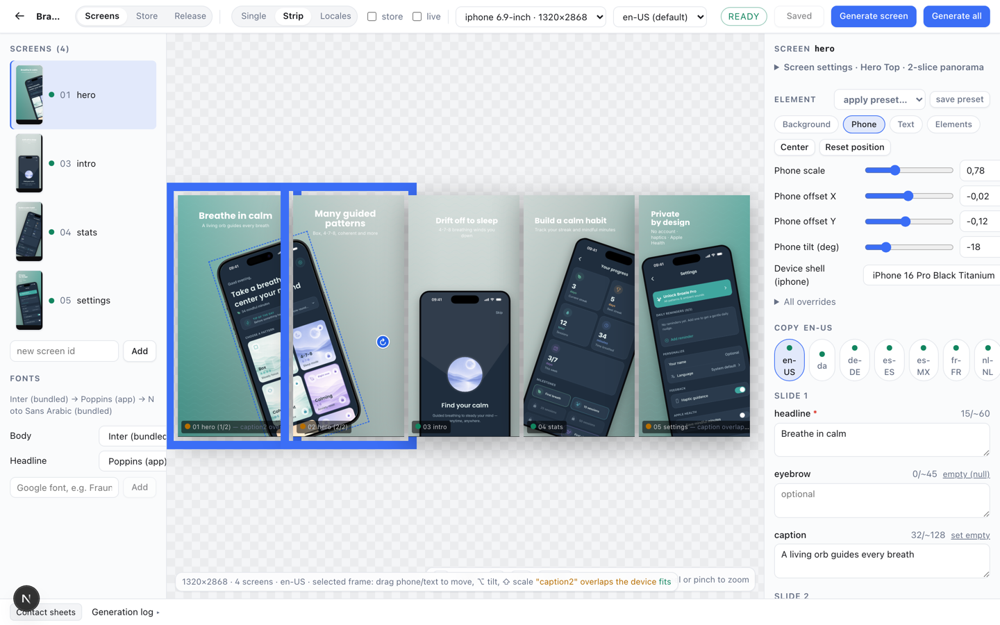
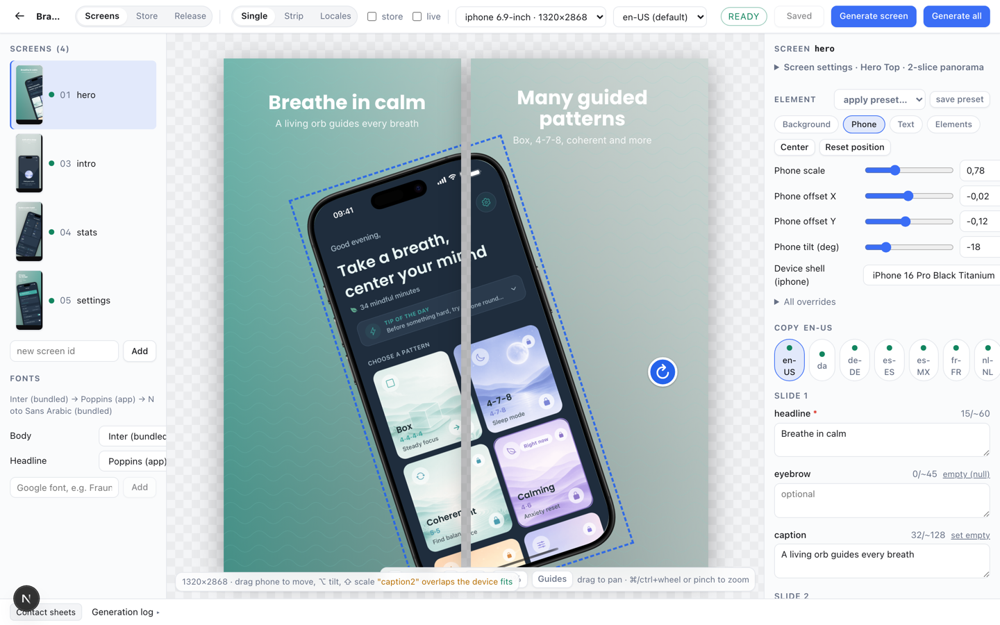
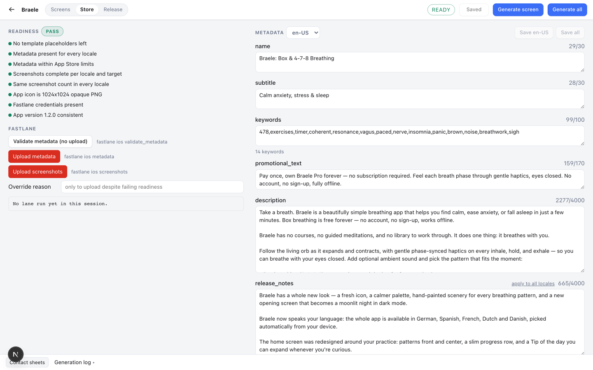
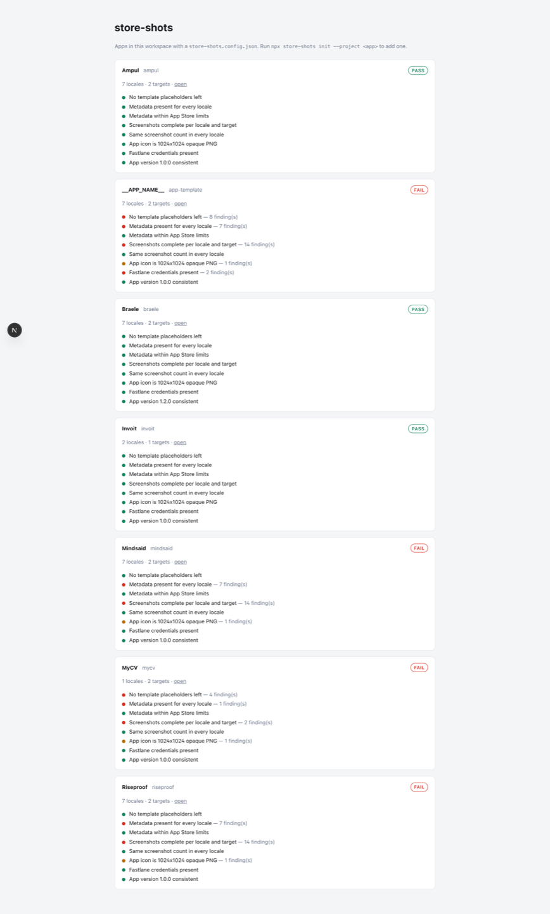

# store-shots

Generate exact-size App Store and Google Play screenshots from raw captures — and catch the
localization problems that quietly break a listing before you upload.



Any screenshot tool will make one nice-looking image. This one tells you that your German
headline overflows the 6.9-inch canvas at the minimum allowed font size, that Arabic needs a
fallback family for three glyphs, and that the third screen in your Play set is stale relative
to its capture. That check is the point of it.

Runs on your machine. No account, no upload — your captures never leave it.

## Quick start

Run `init` inside your app. It scaffolds the files it needs, never overwriting anything that
already exists, and adds the app to your list.

```sh
cd ~/code/my-app
npx store-shots init
```

Add some raw captures, check them, then open the editor:

```sh
npx store-shots capture --screen home --device iphone
npx store-shots validate
npx store-shots open
```

`open` starts the editor and opens your browser at the app you are standing in. If it is
already running, it reuses it rather than starting a second one.

Already have a configured app? `npx store-shots add` registers it without scaffolding.

## The editor

`open` drops you here. Drag the phone to move it, `⌥` to tilt, `⇧` to scale. Copy is edited per
locale on the right, with live character counts against the real store limits.



The status bar is the part that matters. It renders the same checks that will fail a build —
here it is warning that a caption overlaps the device, at the moment you cause it rather than
after you have uploaded five locales.

Three view modes:

- **Single** — one screen at a time
- **Strip** — every screen side by side, the way the store shows them (the image at the top)
- **Locales** — the same screen in every language at once

## Store metadata and readiness

The Store tab edits `fastlane/metadata/<locale>/*.txt` directly, with character budgets from the
same table the fastlane lane enforces. Readiness is on the left; the lanes it gates are on the
right.



It never reads your credential files (`*.p8`, `asc_api_key.json`) — readiness only checks that
they exist — and it never runs a lane that builds or submits.

## Your apps

Apps are added, not discovered. `init` and `add` register one; `projects` lists them.



```sh
npx store-shots projects              # the apps you have added
npx store-shots add [dir]             # add one that already has a config
npx store-shots remove <name>         # drop it from the list (leaves its files alone)
npx store-shots prune                 # drop entries whose config has gone away
npx store-shots projects --scan [dir] # ignore the list, scan a directory instead
```

The list lives in `~/.store-shots/projects.json`. Until you add your first app, `projects` falls
back to scanning so a fresh clone is not an empty screen — it tells you when it is doing that.

## What it does

- **Exact sizes, every target.** iPhone 6.9" (1320×2868), iPad 13" (2064×2752), Play phone
  (1080×1920). No-alpha PNGs that App Store Connect and Play accept without complaint.
- **Localization checks that fail the build.** Text overflow at minimum font size, glyph
  coverage per font, text/device overlap, RTL handling, per-field character budgets.
- **Deterministic and incremental.** Unchanged jobs are skipped; the same inputs always produce
  the same bytes, so a re-run is a no-op rather than a diff.
- **Templates.** `hero-top`, `split-caption`, `full-bleed-card`, free phone positioning,
  background images and patterns, official device frames, panorama screens spanning 2–3 slides.
- **Store-side too.** Readiness checks, metadata editing, Play feature graphics, App Preview
  posters, and a `check` gate for CI.

## Requirements

Node 22 (see `.nvmrc`) and npm. Capturing from an iOS simulator needs macOS with Xcode; every
other command runs anywhere.

```sh
git clone https://github.com/enso-works/appstore-management-tool.git store-shots
cd store-shots
npm ci
```

## Commands

`--project` takes an app directory or its `store-shots.config.json`. Without it, the CLI walks
up from the current directory — so inside your app you can leave it off entirely.

```sh
npx store-shots init      [--project <app>]   # scaffold + add to your list
npx store-shots open      [name|dir]          # start the editor and open a browser
npx store-shots validate  [--project <app>] [--dry-run] [--json]
npx store-shots readiness [--project <app>] [--json]
npx store-shots generate  [--project <app>] [--locale en-US] [--screen home]
                          [--target iphone-6.9-1320x2868] [--strict] [--force] [--dry-run] [--json]
npx store-shots clean     [--project <app>]   # deletes only files in .store-shots-manifest.json
npx store-shots check     [--project <app>]   # CI gate: validate + readiness + metadata limits
npx store-shots capture --screen home --device iphone [--locale de-DE] [--clean-status-bar]
npx store-shots capture --list                # booted simulators
npx store-shots fonts add "Space Grotesk"     # download once from Google Fonts
npx store-shots fonts list|check
npx store-shots metadata validate|show --locale de-DE
npx store-shots lane validate|metadata|screenshots [--yes] [--override "<reason>"]
npx store-shots sheet                         # contact sheets
npx store-shots frames setup|list             # official device frames
```

Exit codes: `0` ok, `1` validation or readiness failed, `2` usage or config error.

## Files in your app

These belong to your app, not to this repo.

```text
<app>/store-shots.config.json
<app>/store/manifest.json
<app>/store/content/<locale>.json
<app>/store/raw/<device>/<locale>/<order>-<id>.png    raw simulator captures
<app>/store/assets/{fonts,logos,backgrounds}/
<app>/fastlane/metadata/<locale>/*.txt                read by readiness
<app>/fastlane/screenshots/<locale>/                  iOS output (deliver)
<app>/fastlane/metadata/android/<locale>/images/phoneScreenshots/   Play output (supply)
```

## Layout

```text
app/              Next.js UI: project list, /projects/<name> editor and readiness, /api/projects/*
cli/index.ts      commander CLI
lib/
  schema.ts       Zod schemas: project config, manifest, locale content, fonts lock
  targets.ts      device profile registry + per-platform output dirs + Play locale map
  locales.ts      App Store Connect locale codes, RTL table, app-language -> store-locale map
  config.ts       config discovery, loading, root-bound path resolution
  registered.ts   the per-machine list of added apps (~/.store-shots/projects.json)
  registry.ts     what the UI lists; scanning as a fallback only
  metadata.ts     fastlane/metadata limits, keyword hygiene
  render-plan.ts  target x locale x screen job list, source/output naming
  validate.ts     pre-render validation
  readiness.ts    store readiness checks
  open.ts         start the editor, pick a free port, reuse a running instance
  fonts.ts        Google Fonts download, fonts.lock.json, @font-face CSS; Inter bundled
  generate.ts     validate -> plan -> render -> flatten -> verify -> atomic write -> manifest
  render/html.tsx render a template to a self-contained HTML document
  render/checks.ts in-page checks (fonts loaded, images decoded, overflow, text/device overlap)
  render/export.ts Playwright Chromium worker + Sharp flatten/inspect
  fastlane.ts     lane allowlist, preflight, spawn with streamed output; never builds or submits
  capture.ts      xcrun simctl screenshot into store/raw/<device>/<locale>/
templates/        React templates: shared pieces, hero-top, split-caption, full-bleed-card
assets/fonts/     bundled Inter (OFL)
schema/           generated JSON Schemas referenced by $schema in app files
fixtures/demo-app two screens, en-US + ar-SA, both targets; used by tests
tests/            vitest
```

## Development

```sh
npm test            # vitest
npm run typecheck
npm run lint
npm run format
npm run schemas     # regenerate schema/*.schema.json from lib/schema.ts
npm run fixtures    # regenerate fixtures/demo-app
```

Further reading: [`docs/templates.md`](docs/templates.md) for writing a template,
[`docs/troubleshooting.md`](docs/troubleshooting.md), [`docs/roadmap.md`](docs/roadmap.md).

## Background

I wrote up why the hosted generators stopped fitting and what I built instead:
[I built my own App Store screenshot generator](https://bavrk.com/articles/app-store-screenshot-generator).

## License

[MIT](LICENSE). Use it, change it, ship it in whatever you are building.

Built by [Ensar Bavrk](https://bavrk.com).
