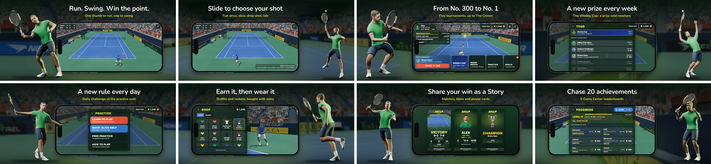
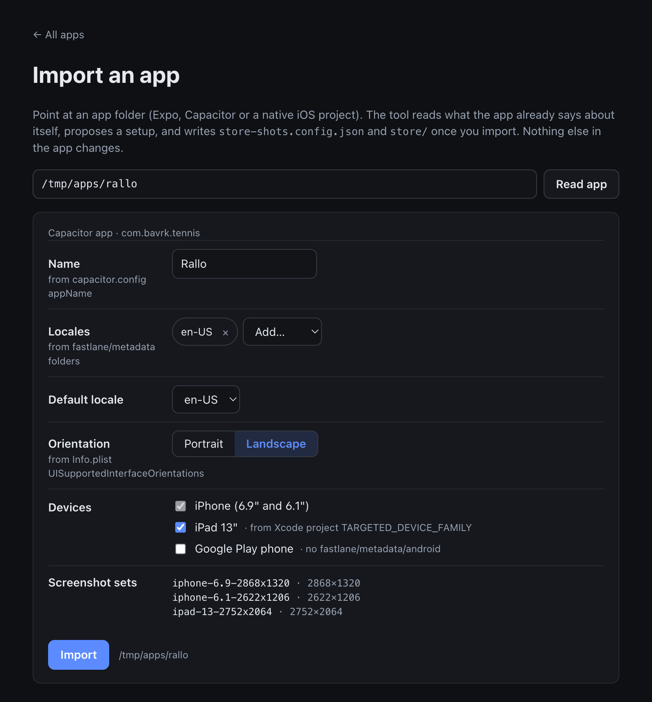
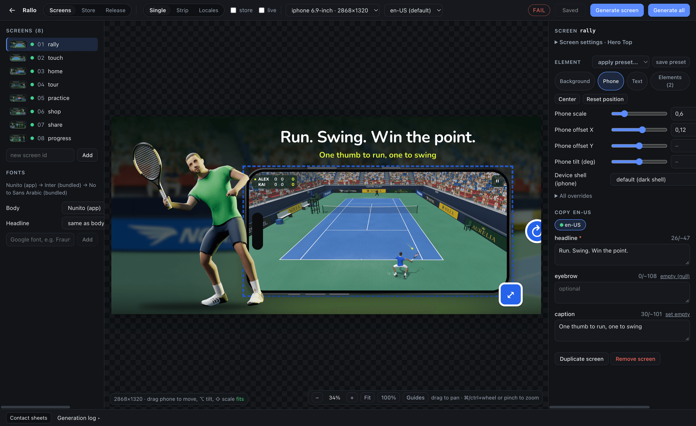
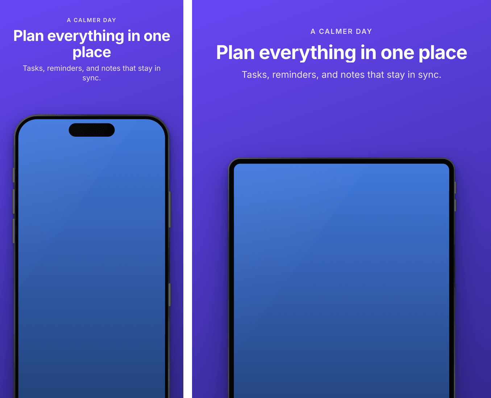
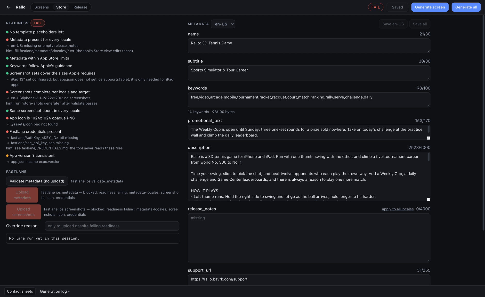

# store-shots

**App Store and Google Play screenshots, built from your app's real captures and checked against
the rules that get listings rejected.** Open source, runs on your Mac, no account, nothing
uploaded.



That listing is one project in this tool: the game's own captures in a real iPhone body, a 3D
player rendered from the game's models in front of each phone, and a stadium backdrop that runs
on from one screen to the next. The players alternate sides, so on the store page they face each
other across the gaps.

Making an image look good is the easy half. The other half is knowing, before you upload, that
the German headline no longer fits at the smallest allowed size, that Arabic needs a fallback
font for three glyphs, that the keywords are 104 bytes in Japanese, and that a caption still
says "50% off". The tool checks all of that while you edit.

## Quick start

```sh
git clone https://github.com/enso-works/appstore-management-tool.git store-shots
cd store-shots && npm ci
npx store-shots open
```

Then **Import an app** and point it at the app's folder. It reads what the app already says
about itself and proposes a setup you can change before anything is written:

- name and bundle id from Expo's `app.json`, a Capacitor config, or the Xcode project
- locales from `fastlane/metadata`, or the app's own languages
- landscape sets for an app that only runs sideways, iPad sets only if it runs on iPad
- Google Play sets when `fastlane/metadata/android` exists



Importing writes `store-shots.config.json` and a `store/` folder into the app, never overwrites
anything, and adds the app to your list. From a terminal, `npx store-shots init` inside the app
does the same.

## The editor

Each screen is a template filled with copy per locale, a raw capture, and whatever you put on it.
Drag the phone or the text; `⌥` tilts, `⇧` scales. Copy is edited on the right, with a live
character budget for the template and target.



The status pill at the top runs the same checks a build does, as you edit: text that overflows at
the minimum font scale, text over the device, missing glyphs, missing copy in a locale.

- **Single**: one screen at a time.
- **Strip**: every screen side by side, the way the store shows them, wrapped into rows when
  that shows them larger (landscape sets start wrapped). The screens App Store search shows are
  tagged: the first three in portrait, the first one in landscape.
- **Locales**: one screen in every language at once.

## A phone that looks like one

The capture sits in a drawn iPhone 16 Pro body: titanium band, glass border, Dynamic Island,
action and volume buttons, side button and Camera Control, all in the right place in portrait and
landscape. iPads get their own band and buttons. The body is drawn around the display, so the
capture keeps its full size. Official device frames from `fastlane frameit` work too
(`frames setup`, then `shell: "frame:<device>"`).



## Art on top

Any screen can carry image and text layers above the template: a badge, a logo, or a character
standing in front of the phone. Pick art from `store/assets` by thumbnail, drag it like the
phone, and limit it to some targets: a wide iPhone canvas and a squarer iPad canvas want
different positions. The Elements panel shows which targets each layer draws on, dims the ones
the current target does not show, and **Own copy here** splits a shared layer so this target's
copy moves on its own.

Rallo's players are rendered in Blender from the game's own rigged model and animations, the
backdrop is an equirectangular render of the game's stadium, and the scripts that make them live
in the app (`store/scenes/`). `scenes` in the config lists them as steps, and `store-shots scenes
render` runs the ones whose scripts or inputs changed, Blender headless, then the Python
post-processing. `--quick` renders a quarter-size draft into `store/generated/scenes/` and leaves
`store/assets` alone.

```json
"scenes": {
  "steps": [
    { "id": "characters", "blender": "store/scenes/characters.py", "args": ["{work}/chars"],
      "inputs": ["public/models/nole.glb"] },
    { "id": "post", "python": "store/scenes/post.py", "needs": ["characters"],
      "outputs": ["store/assets/characters/serve.png"] }
  ]
}
```

## Store metadata and readiness

The Store tab edits `fastlane/metadata/<locale>/*.txt` directly, with the limits the fastlane
lane enforces. Readiness runs next to the lanes it gates.



Readiness follows Apple's own guidance, checked against Apple's pages:

- **Sizes**: the 6.1" iPhone set Apple names as required, and iPad 13" for iPad apps
- **Keywords**: 100 bytes (not characters), no plurals of words already there, no category names,
  no "app", no repeated words, nothing under three characters
- **Screenshot copy**: no prices, discounts, URLs, ©, other platforms or stores, or Apple awards
- **Files**: PNG or JPEG, exact sizes, no alpha, the same count in every locale
- **Dark Mode**: a screen marked as dark when the app follows the system appearance
- **Icons**: dark and tinted variants (Expo `ios.icon`, an Icon Composer file, or the asset
  catalog)
- **App previews** in `store/previews/<locale>/`: 886x1920 or 1200x1600 either way round,
  15-30 seconds, at most 30 fps and 500 MB, three per device

Readiness only checks that credential files exist. It never runs a lane that builds or submits.

## Product page variants

Custom product pages (up to 70) and optimization treatments (up to 3 per test) are pages in the
editor: pick one from the page menu next to the locale, or make a new one there.

- The sidebar shows the page's screens in its own order (move them, take them off, add any
  screen, including ones the default page leaves out).
- Copy you edit while a page is shown belongs to that page; everything else comes from the
  default page.
- A custom page has a deep link, and per locale its promotional text (170 characters) and the
  keywords it answers to, picked from the app's own keyword field. A treatment can test an
  alternate app icon.
- Strip mode shows the page as the store would, and Generate renders it into
  `store/generated/sets/<id>/<locale>/`, numbered from 01.

```json
"sets": [{ "id": "runners", "kind": "custom", "name": "Runners", "deepLink": "rallo://tour",
           "screens": ["tour", "rally", "home"] }]
```

The page's own text lives in each locale's content file under `sets.<id>`.

### App Store Connect

`asc status` lists the app's versions, custom product pages and experiments and matches them to
the manifest. `asc push <set>` uploads a page or treatment as a draft: it creates or updates the
page, its version, localizations, promotional text, keywords and screenshots, and stores App
Store Connect's id in the manifest. It shows its plan first and changes nothing without `--yes`;
the editor's page panel does the same with **Check** and **Upload draft**. It never submits for
review: that stays a click in App Store Connect. It refuses stale renders, and leaves a page that
is in review alone.

It signs its requests with the app's App Store Connect key, found the way fastlane and Apple's
tools find it: `APP_STORE_CONNECT_API_KEY_PATH`, `fastlane/asc_api_key.json`, or
`AuthKey_<KEY_ID>.p8` in `fastlane/` or `~/.appstoreconnect/private_keys` with the ids from the
Fastfile. The key is read in memory only to sign a token, and never written or logged.
`asc push default` does the same for the app's own product page: on the version that takes edits
(Prepare for Submission, or rejected) it uploads the default page's screenshots, iPhone Duo
screenshots, header and search results images, and the app previews in `store/previews/<locale>/`.
Text stays deliver's job, and so does making the version. With no version taking edits it says
which is live or in review, and still puts the page's header and search results images in the
Asset Library as drafts. `asc submit default` submits those images for review (images only: the
tool never submits a version, page or experiment, and refuses when an unsent submission already
holds anything else). Once Apple approves them, the next `asc push default` places them on the live
page as its header and search results, no new version needed. The editor has the same Check and Upload draft under
**Default page in App Store Connect**.

Treatments with the same `experiment` name are tested together; **unlink** in the page panel
forgets a page's App Store Connect id after you delete the page or end the test there.

### iPhone Duo

The foldable iPhone has its own screenshot sets, which App Store Connect requires from April 2027:
`iphone-duo-1398x2034` (outer screen) and `iphone-duo-2007x2853` (inner screen), and the same
landscape. They render from the iPhone captures (or from Duo captures, with `sourceDevices`) into
`store/generated/duo/<locale>/`, because deliver has no display type for them. `asc push` uploads
them through the Asset Library, in the page's order, for custom pages, treatments and the default
page. Readiness notes when an app has none yet.

### Header and search results images

Since iOS 27 a product page can lead with a wide header image, and search results can show a
creative asset instead of the first screenshots. Three opt-in targets render them from the iPhone
captures with the `feature-graphic` layout:

- `header-3840x1646`: the product page header (21:9);
- `search-3840x2560`: the search results asset (3:2);
- `universal-5244x2950`: one 16:9 image for both. App Store Connect crops it to 21:9 for the
  header and 3:2 for search, so the layout keeps text and device where both crops show them, and
  **Guides** in the editor draws the two crops.

A page shows one of each: the default page from its enabled screens (into
`store/generated/creative/<locale>/`), a custom page or treatment from its own screens. A screen
made only for them takes no screenshot position, so give it `"enabled": false` and add it to the
pages that show it. `asc push` puts them in the app's Asset Library, named with their checksum so an
unchanged image is not sent again, and places them on the page once Apple has processed them.
When a page has no image of its own for a slot, a placement made by hand in App Store Connect stays. The page panel names the page's header and search screens, and readiness checks
every rendered one.

### In-app events

Event media render from the same captures, whichever way round the app runs: `event-card-1920x1080`
(with the `feature-graphic` layout) and `event-detail-1080x1920`, into `store/generated/events/`.
Like the Play feature graphic, they are opt-in per screen: only screens that list them in
`targets` render for them.

## Mac app

`mac/` is a native window around the editor: a project picker with readiness, File > Import
App... (Command-O), reload, reveal in Finder, a server log, and settings for the tool folder and
port. It uses an editor that is already running, or starts one and stops it on quit, and starts
its own if the one it was using goes away.

```sh
brew install xcodegen
sh mac/build.sh --open
```

See [`mac/README.md`](mac/README.md) for shortcuts and details.

## Screenshot sizes

Every target renders at the exact pixel size the store accepts, as an opaque PNG.

| Target                                                              | Store                                                  | Size        |
| ------------------------------------------------------------------- | ------------------------------------------------------ | ----------- |
| `iphone-6.9-1320x2868`                                              | App Store, iPhone 6.9"                                 | 1320 × 2868 |
| `iphone-6.1-1206x2622`                                              | App Store, iPhone 6.1" (the size Apple names required) | 1206 × 2622 |
| `ipad-13-2064x2752`                                                 | App Store, iPad 13" (required for iPad apps)           | 2064 × 2752 |
| `iphone-6.9-2868x1320`, `iphone-6.1-2622x1206`, `ipad-13-2752x2064` | The same, landscape                                    |             |
| `play-phone-1080x1920`                                              | Google Play, phone                                     | 1080 × 1920 |
| `play-feature-1024x500`                                             | Google Play, feature graphic                           | 1024 × 500  |
| `appreview-6.9-886x1920`                                            | App Preview poster                                     | 886 × 1920  |
| `event-card-1920x1080`, `event-detail-1080x1920`                    | In-app event card and details page                     |             |
| `iphone-duo-1398x2034`, `iphone-duo-2007x2853` (and landscape)      | App Store, iPhone Duo outer and inner screen           |             |
| `header-3840x1646`                                                  | App Store product page header (iOS 27)                 | 3840 × 1646 |
| `search-3840x2560`                                                  | App Store search results asset (iOS 27)                | 3840 × 2560 |
| `universal-5244x2950`                                               | Header and search results in one image (iOS 27)        | 5244 × 2950 |

`generate` renders every target × locale × screen, checks the size of each file before writing
it, and skips anything whose inputs have not changed.

## Commands

`--project` takes an app folder or its config. Without it, the CLI looks upward from the current
folder, so inside an app you can leave it off.

```sh
npx store-shots open      [name|dir]          # start the editor (or reuse a running one) and open it
npx store-shots init      [--project <app>] [--landscape|--portrait]
npx store-shots add       [dir]               # add an app that already has a config
npx store-shots projects | remove <name> | prune
npx store-shots validate  [--project <app>] [--dry-run] [--json]
npx store-shots readiness [--project <app>] [--json]
npx store-shots generate  [--project <app>] [--locale de-DE] [--screen home] [--target <id>]
                          [--set <id>] [--strict] [--force] [--dry-run] [--json]
npx store-shots check     [--project <app>]   # CI gate: validate + readiness + metadata limits
npx store-shots capture   --screen home --device iphone [--locale de-DE] [--clean-status-bar]
npx store-shots fonts     add "Space Grotesk" | list | check
npx store-shots metadata  validate | show --locale de-DE
npx store-shots lane      validate | metadata | screenshots [--yes] [--override "<reason>"]
npx store-shots sheet                         # contact sheets
npx store-shots frames    setup | list        # official device frames
npx store-shots scenes    list | render [step...] [--force] [--quick]   # the app's Blender art
npx store-shots asc       status | push <set> [--yes]                   # App Store Connect drafts
npx store-shots clean     [--project <app>]   # removes only files the tool wrote
```

Exit codes: `0` ok, `1` validation or readiness failed, `2` usage or config error.

## Files in your app

```text
store-shots.config.json
store/manifest.json                            screens, order, template, layers
store/content/<locale>.json                    copy per locale
store/raw/<device>/<locale>/<order>-<id>.png   captures (never written by the tool)
store/assets/                                  fonts, logos, backgrounds, layer art
store/scenes/                                  optional: the scripts behind the art
store/previews/<locale>/                       optional: App Preview videos, checked by readiness
store/generated/                               sets, event media, posters, scene renders (gitignored)
fastlane/metadata/<locale>/*.txt               store text, read and edited by the Store tab
fastlane/screenshots/<locale>/                 iOS output, uploaded by deliver
fastlane/metadata/android/<locale>/images/     Play output, uploaded by supply
```

The list of apps you added lives in `~/.store-shots/projects.json`.

## Layout

```text
app/          Next.js editor: app list, import, /projects/<name>, /api/*
cli/          the CLI
lib/          config, schemas, targets, import, validation, readiness, rendering, generation
templates/    React templates and the device body
mac/          the Mac app (SwiftUI, XcodeGen)
schema/       JSON Schemas for the files in your app
fixtures/     the demo app the tests use
tests/        vitest
docs/         templates, troubleshooting, roadmap
```

## Development

Node 22 (`.nvmrc`). Capturing from a simulator needs Xcode; everything else runs on any OS.

```sh
npm test && npm run typecheck && npm run lint && npm run format:check
npm run schemas     # regenerate schema/ from lib/schema.ts
npm run fixtures    # regenerate fixtures/demo-app
```

More: [writing a template](docs/templates.md), [troubleshooting](docs/troubleshooting.md),
[roadmap](docs/roadmap.md). Why this exists:
[I built my own App Store screenshot generator](https://bavrk.com/articles/app-store-screenshot-generator).

## License

[MIT](LICENSE). Built by [Ensar Bavrk](https://bavrk.com).
